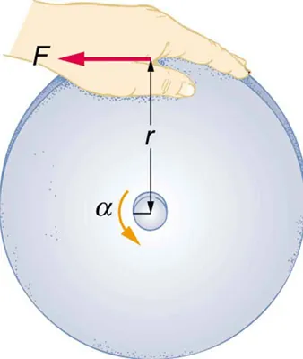

* Derive the equation for rotational work.
* Calculate rotational kinetic energy.
* Demonstrate the Law of Conservation of Energy.

In this module, we will learn about work and energy associated with rotational
motion. [Figure 1](#Figure1) shows a worker using an electric grindstone propelled
by a motor. Sparks are flying, and noise and vibration are created as layers of
steel are pared from the pole. The stone continues to turn even after the motor
is turned off, but it is eventually brought to a stop by friction. Clearly, the
motor had to work to get the stone spinning. This work went into heat, light,
sound, vibration, and considerable **rotational kinetic energy** .

')
{: #Figure1}

Work must be done to rotate objects such as grindstones or merry-go-rounds. Work
was defined
in [Uniform Circular Motion and Gravitation](./ch6UniformCircularMotionAndGravitation)
for translational motion, and we can build on that knowledge when considering
work done in rotational motion. The simplest rotational situation is one in
which the net force is exerted perpendicular to the radius of a disk (as shown
in [Figure 2](#Figure2)) and remains perpendicular as the disk starts to rotate.
The force is parallel to the displacement, and so the net work done is the
product of the force times the arc length traveled:

 $$ \text{net}W=\left(\text{net}F\right)\Delta s. $$

To get torque and other rotational quantities into the equation, we multiply and
divide the right-hand side of the equation by $$ r $$, and gather terms:

 $$ \text{net}W=\left(r\text{net}F\right)\frac{ \Delta s}{r}. $$

We recognize that $$ r\text{net}F=\text{net τ} $$ and $$ \Delta s/r=\theta $$,
so that

 $$ \text{net}W=\left(\text{net τ}\right)\theta . $$

This equation is the expression for rotational work. It is very similar to the
familiar definition of translational work as force multiplied by distance. Here,
torque is analogous to force, and angle is analogous to distance. The equation
$$ \text{net}W=\left(\text{net τ}\right)\theta $$ is valid in general, even
though it was derived for a special case.

To get an expression for rotational kinetic energy, we must again perform some
algebraic manipulations. The first step is to note that $$ \text{net τ}=I\alpha $$

, so that

 $$ \text{net}W=I \alpha \theta . $$

. The net work goes into rotational kinetic energy.")
{: #Figure2}

Making Connections

Work and energy in rotational motion are completely analogous to work and energy in translational motion, first presented in [Uniform Circular Motion and Gravitation](./ch6UniformCircularMotionAndGravitation).

Now, we solve one of the rotational kinematics equations for $$ \alpha \theta $$. We start with the equation

 $$ \omega^{2}= \omega_{0}^{2}+2 \alpha \theta. $$

Next, we solve for $$ \alpha \theta $$:

 $$ \alpha \theta=\frac{ \omega^{2}- \omega_{0}^{2} }{2}. $$

Substituting this into the equation for net $$ W $$ and gathering terms yields

 $$ \text{net}W=\frac{1}{2}I\omega^{2}-\frac{1}{2}I \omega_{0}^{2}. $$

This equation is the **work-energy theorem** for rotational motion only. As you
may recall, net work changes the kinetic energy of a system. Through an analogy
with translational motion, we define the term $$ \left(\frac{1}{2}\right) I\omega^{2} $$ to be
**rotational kinetic energy** $$ \KE_{\text{rot}} $$ for an object with a moment
of inertia $$ I $$ and an angular velocity $$ \omega $$ :

 $$ \KE_{\text{rot}}=\frac{1}{2} I\omega^{2}. $$

The expression for rotational kinetic energy is exactly analogous to
translational kinetic energy, with $$ I $$ being analogous to $$ m $$ and $$ \omega $$ to $$ v $$. Rotational kinetic energy has important effects.
Flywheels, for example, can be used to store large amounts of rotational kinetic
energy in a vehicle, as seen in [Figure 3](#Figure3).

. It can also convert translational kinetic energy, when the bus stops, into \( \KE_{\text{rot}} /). The flywheel&#x2019;s energy can then be used to accelerate, to go up another hill, or to keep the bus from going against friction.")
{: #Figure3}

Calculating the Work and Energy for Spinning a Grindstone

Consider a person who spins a large grindstone by placing her hand on its edge and exerting a force through part of a
revolution as shown in [Figure 4](#Figure4). In this example,
we verify that the work done by the torque she exerts equals the change in rotational energy.
(a) How much work is done if she exerts a force of 200 N through
a rotation of $$ 1.00 \text{rad}\left(57.3^\circ\right) $$?
The force is kept perpendicular to the grindstone’s 0.320-m radius at the
point of application, and the effects of friction are negligible.
(b) What is the final angular velocity if the grindstone has a mass of 85.0 kg?
(c) What is the final rotational kinetic energy? (It should equal the work.)

**Strategy**

To find the work, we can use the equation $$ \text{net}W=\left(\text{net τ}\right)\theta $$. We have enough information to calculate the torque and are
given the rotation angle. In the second part, we can find the final angular
velocity using one of the kinematic relationships. In the last part, we can
calculate the rotational kinetic energy from its expression in $$ \KE_ {\text{rot}}=\frac{1}{2}I\omega^{2} $$.

**Solution for (a)**

The net work is expressed in the equation

 $$ \text{net}W=\left(\text{net τ}\right)\theta , $$

where net $$ \tau $$ is the applied force multiplied by the radius $$ \left(rF\right) $$ because
there is no retarding friction, and the force is perpendicular to $$ r $$. The
angle $$ \theta $$ is given. Substituting the given values in the equation above
yields

$$ \begin{array}{lll}
\text{net}W&=& rF\theta =\left(0.320 \m \right)\left(200 \N \right)\left(1.00 \text{rad}\right)\\
\text{net}W&=& 64.0 \N \cdot \m .
\end{array} $$

Noting that $$ 1 \N·\m =1 \J $$,

 $$ \text{net}W=64.0 \J . $$

{: #Figure4 height="225"}

**Solution for (b)**

To find $$ \omega $$ from the given information requires more than one step. We
start with the kinematic relationship in the equation

 $$ \omega^{2}=\omega_{0}^{2}+2 \alpha \theta. $$

Note that $$ \omega_{0}=0 $$ because we start from rest. Taking the square root of the resulting equation
gives

 $$ \omega ={\left(2 \alpha \theta\right)}^{1/2}. $$

Now we need to find $$ \alpha $$. One possibility is

 $$ \alpha =\frac{ \text{net τ}}{I}, $$

where the torque is

 $$ \text{net τ}=rF=\left(0.320 \m \right)\left(200 \N \right)=64.0 \N \cdot \m . $$

The formula for the moment of inertia for a disk is found
in [Figure 3 of Dynamics Of Rotational Motion](./ch10DynamicsOfRotationalMotion#Figure3) :

 $$ I=\frac{1}{2} MR^{2}=0.5\left(85.0 \kg \right){\left(0.320 \m \right)}^{2}=4.352 \kg \cdot \mm. $$

Substituting the values of torque and moment of inertia into the expression for $$ \alpha $$,
we obtain

 $$ \alpha =\frac{64.0 \N \cdot \m }{4.352 \kg \cdot \mm}=14.7 \radss . $$

Now, substitute this value and the given value for $$ \theta $$
into the above expression for $$ \omega $$:

 $$ \omega ={\left(2 \alpha \theta \right)}^{1/2}= {\left[2\left(14.7 \radss \right) \left(1.00 \text{rad} \right) \right]}^{1/2} =5.42 \rads . $$ 

**Solution for (c)**

The final rotational kinetic energy is

 $$ \KE_{\text{rot}}=\frac{1}{2}I\omega^{2}. $$

Both $$ I $$ and $$ \omega $$ were found above. Thus,

 $$ \KE_{\text{rot}}=\left(0.5\right)\left(4.352 \kg \cdot \mm\right){\left(5.42 \rads \right)}^{2}=64.0 \J . $$

**Discussion**

The final rotational kinetic energy equals the work done by the torque, which
confirms that the work done went into rotational kinetic energy. We could, in
fact, have used an expression for energy instead of a kinematic relation to
solve part (b). We will do this in later examples.

Helicopter pilots are quite familiar with rotational kinetic energy. They know,
for example, that a point of no return will be reached if they allow their
blades to slow below a critical angular velocity during flight. The blades lose
lift, and it is impossible to immediately get the blades spinning fast enough to
regain it. Rotational kinetic energy must be supplied to the blades to get them
to rotate faster, and enough energy cannot be supplied in time to avoid a crash.
Because of weight limitations, helicopter engines are too small to supply both
the energy needed for lift and to replenish the rotational kinetic energy of the
blades once they have slowed down. The rotational kinetic energy is put into
them before takeoff and must not be allowed to drop below this crucial level.
One possible way to avoid a crash is to use the gravitational potential energy
of the helicopter to replenish the rotational kinetic energy of the blades by
losing altitude and aligning the blades so that the helicopter is spun up in the
descent. Of course, if the helicopter’s altitude is too low, then there is
insufficient time for the blade to regain lift before reaching the ground.

Problem-Solving Strategy for Rotational Energy

1.  *Determine that energy or work is involved in the rotation*.
2.  *Determine the system of interest*. A sketch usually helps.
3.  *Analyze the situation to determine the types of work and energy involved*.
4.  *For closed systems, mechanical energy is conserved*. That is,
 $$ \KE_{\text{i}}+\PE_{\text{i}}=\KE_{\text{f}}+\PE_{\text{f}}. $$
    Note that $$ \KE_{\text{i}} $$ and $$ \KE_{\text{f}} $$ may each include translational and rotational contributions.

5. _For open systems_, mechanical energy may not be conserved, and other forms
   of energy ( referred to previously as $$ \text{OE} $$), such as heat
   transfer, may enter or leave the system. Determine what they are, and
   calculate them as necessary.
6. _Eliminate terms wherever possible to simplify the algebra_.
7. _Check the answer to see if it is reasonable_.

Calculating Helicopter Energies

A typical small rescue helicopter, similar to the one in [Figure 5](#Figure5), has
four blades, each is 4.00 m long and has a mass of 50.0 kg. The blades can be approximated as thin rods that rotate about one end of an axis perpendicular to their length. The helicopter has a total loaded mass of 1000 kg.
(a) Calculate the rotational kinetic energy in the blades when they rotate at 300 rpm.
(b) Calculate the translational kinetic energy of the helicopter when it flies at 20.0 m/s, and compare it with the rotational energy in the blades.
(c) To what height could the helicopter be raised if all of the rotational kinetic energy could be used to lift it?

**Strategy**

Rotational and translational kinetic energies can be calculated from their
definitions. The last part of the problem relates to the idea that energy can
change form, in this case from rotational kinetic energy to gravitational
potential energy.

**Solution for (a)**

The rotational kinetic energy is

 $$ \KE_{\text{rot}}=\frac{1}{2}I\omega^{2}. $$

We must convert the angular velocity to radians per second and calculate the moment of inertia before we can find $$ \KE_{\text{rot}} $$. The angular velocity $$ \omega $$
is

 $$ \omega =\frac{300 \text{rev}}{1.00 \text{min}}\cdot \frac{2 \pi \text{rad}}{1 \text{rev}}\cdot \frac{1.00 \text{min}}{60.0 \s }=31.4\frac{ \text{rad}}{\s}. $$

The moment of inertia of one blade will be that of a thin rod rotated about its end,
found in [Figure 3 Dynamics Of Rotational Motion](./ch10DynamicsOfRotationalMotion#Figure3). The total $$ I $$
is four times this moment of inertia, because there are four blades. Thus,

 $$ I=4\frac{ M\ell^{2}}{3}=4×\frac{ \left(50.0 \kg \right){\left(4.00 \m \right)}^{2}}{3}=1067 \kg \cdot \mm. $$

Entering $$ \omega $$ and $$ I $$ into the expression for rotational kinetic energy gives

$$ \begin{array}{lll} $$
\KE_{\text{rot}}&=& 0.5\left(1067 \kg \cdot \mm\right){\left(31.4 \rads \right)}^{2}\\
\KE_{\text{rot}}&=& 5.26\times 10^{5} \J
\end{array} $$ $$

**Solution for (b)**

Translational kinetic energy was defined
in [Uniform Circular Motion and Gravitation](./ch6UniformCircularMotionAndGravitation)
. Entering the given values of mass and velocity, we obtain

 $$ \KE_{\text{trans}}=\frac{1}{2}m v^{2}=\left(0.5\right)\left(1000 \kg \right){\left(20.0 \ms \right)}^{2}=2.00\times 10^{5} \J . $$

To compare kinetic energies, we take the ratio of translational kinetic energy to rotational kinetic energy. This ratio is

 $$ \frac{2.00\times 10^{5} \J }{5.26\times 10^{5} \J }=0.380. $$

**Solution for (c)**

At the maximum height, all rotational kinetic energy will have been converted to
gravitational energy. To find this height, we equate those two energies:

 $$ \KE_{\text{rot}}=\PE_{\text{grav}} $$

or

 $$ \frac{1}{2}I\omega^{2}=mgh . $$

We now solve for $$ h $$ and substitute known values into the resulting equation

 $$ h=\frac{ \frac{1}{2} I \omega^{2} }{mg}=\frac{5.26\times 10^{5} \J }{\left(1000 \kg \right)\left(9.80\mss \right)}=53.7 \m . $$

**Discussion**

The ratio of translational energy to rotational kinetic energy is only 0.380.
This ratio tells us that most of the kinetic energy of the helicopter is in its
spinning blades—something you probably would not suspect. The 53.7 m height to
which the helicopter could be raised with the rotational kinetic energy is also
impressive, again emphasizing the amount of rotational kinetic energy in the
blades.

')
{: #Figure5 height="300"}

Making Connections

Conservation of energy includes rotational motion, because rotational
kinetic energy is another form of $$ \KE $$. [Uniform Circular Motion and Gravitation](./ch6UniformCircularMotionAndGravitation) has a detailed
treatment of conservation of energy.

### How Thick Is the Soup? Or Why Don’t All Objects Roll Downhill at the Same Rate?

One of the quality controls in a tomato soup factory consists of rolling filled
cans down a ramp. If they roll too fast, the soup is too thin. Why should cans
of identical size and mass roll down an incline at different rates? And why
should the thickest soup roll the slowest?

The easiest way to answer these questions is to consider energy. Suppose each
can starts down the ramp from rest. Each can starting from rest means each
starts with the same gravitational potential energy $$ \PE_{\text{grav}} $$,
which is converted entirely to $$ \KE $$, provided each rolls without slipping.
$$ \KE $$, however, can take the form of $$ \KE_ {\text{trans}} $$ or $$ \KE\_{\text{rot}} $$, and total $$ \KE $$ is the sum of
the two. If a can rolls down a ramp, it puts part of its energy into rotation,
leaving less for translation. Thus, the can goes slower than it would if it slid
down. Furthermore, the thin soup does not rotate, whereas the thick soup does,
because it sticks to the can. The thick soup thus puts more of the can’s
original gravitational potential energy into rotation than the thin soup, and
the can rolls more slowly, as seen in [Figure 6](#Figure6).

. The third can contains thick soup. It comes in third because the soup rotates along with the can, taking even more of the initial PE for rotational KE, leaving less for translational KE.')
{: #Figure6}

Assuming no losses due to friction, there is only one force doing work—gravity.
Therefore the total work done is the change in kinetic energy. As the cans start
moving, the potential energy is changing into kinetic energy. Conservation of
energy gives

 $$ \PE_\text{i}=\KE_\text{f}. $$

More specifically,

 $$ \PE_{\text{grav}}=\KE_{\text{trans}}+\KE_{\text{rot}} $$

or

 $$ mgh =\frac{1}{2}m v^{2}+\frac{1}{2}I\omega^{2} . $$

So, the initial $$ mgh $$ is divided between translational kinetic energy and
rotational kinetic energy; and the greater $$ I $$ is, the less energy goes into
translation. If the can slides down without friction, then $$ \omega =0 $$ and
all the energy goes into translation; thus, the can goes faster.

Take-Home Experiment

Locate several cans each containing different types of food. First, predict which can will win the race down an inclined plane and explain why. See if your prediction is correct. You could also do this experiment by collecting several empty cylindrical containers of the same size and filling them with different materials such as wet or dry sand.

Calculating the Speed of a Cylinder Rolling Down an Incline

Calculate the final speed of a solid cylinder that rolls down a 2.00-m-high incline. The cylinder starts from rest, has a mass of 0.750 kg, and has a radius of 4.00 cm.

**Strategy**

We can solve for the final velocity using conservation of energy, but we must
first express rotational quantities in terms of translational quantities to end
up with $$ v $$ as the only unknown.

**Solution**

Conservation of energy for this situation is written as described above:

 $$ mgh =\frac{1}{2}m v^{2}+\frac{1}{2}I\omega^{2} . $$

Before we can solve for $$ v $$, we must get an expression for $$ I $$
from [Figure 3 of Dynamics Of Rotational Motion](./ch10DynamicsOfRotationalMotion#Figure3). Because $$ v $$ and $$ \omega $$
are related (note here that the cylinder is rolling without slipping), we must
also substitute the relationship $$ \omega =v/R $$ into the expression. These
substitutions yield

 $$ mgh =\frac{1}{2}m v^{2}+\frac{1}{2}\left(\frac{1}{2}m R^{2}\right)\left(\frac{ v^{2}}{ R^{2}}\right). $$

Interestingly, the cylinder’s radius $$ R $$ and mass $$ m $$ cancel, yielding

 $$ g h =\frac{1}{2}{v}^{2}+\frac{1}{4}{v}^{2}=\frac{3}{4}{v}^{2} . $$

Solving algebraically, the equation for the final velocity $$ v $$ gives

 $$ v=\sqrt{ \frac{4 g h }{3} } . $$

Substituting known values into the resulting expression yields

 $$ v=\sqrt{ \frac{4\left(9.80\mss \right)\left(2.00 \m \right)}{3} }=5.11 \ms . $$

**Discussion**

Because $$ m $$ and $$ R $$ cancel, the result $$ v=\sqrt{\frac{4}{3}g h} $$ is
valid for any solid cylinder, implying that all solid cylinders will roll down
an incline at the same rate independent of their masses and sizes. (Rolling
cylinders down inclines is what Galileo actually did to show that objects fall
at the same rate independent of mass.) Note that if the cylinder slid without
friction down the incline without rolling, then the entire gravitational
potential energy would go into translational kinetic energy. Thus, $$ \frac{1}{2}m v^{2}=mgh $$ and $$ v=\sqrt{2g h } $$, which is 22% greater than $$ \sqrt{4g h /3} $$. That is, the cylinder would go faster at the bottom.

Check Your Understanding

Analogy of Rotational and Translational Kinetic Energy
Is rotational kinetic energy completely analogous to translational kinetic energy?
What, if any, are their differences? Give an example of each type of kinetic energy.

Yes, rotational and translational kinetic energy are exact analogs.
They both are the energy of motion involved with the coordinated (non-random)
movement of mass relative to some reference frame. The only difference between
rotational and translational kinetic energy is that translational is straight
line motion while rotational is not. An example of both kinetic and translational
kinetic energy is found in a bike tire while being ridden down a bike path.
The rotational motion of the tire means it has rotational kinetic energy while
the movement of the bike along the path means the tire also has translational
kinetic energy. If you were to lift the front wheel of the bike and spin it
while the bike is stationary, then the wheel would have only rotational
kinetic energy relative to the Earth.

 My Solar System

Build your own system of heavenly bodies and watch the gravitational ballet.
With this orbit simulator, you can set initial positions, velocities,
and masses of 2, 3, or 4 bodies, and then see them orbit each other.

<figure markdown="1">
<iframe loading="lazy" src="https://veillette.github.io/simulations/my-solar-system/#sim-my-solar-system" width="750" height="500"  allowfullscreen></iframe>
<figcaption>
My solar system
</figcaption>
</figure>

### Section Summary

- The rotational kinetic energy $$ \KE\_ {\text{rot}} $$ for an object with a moment of inertia $$ I $$ and an angular
  velocity $$ \omega $$ is given by
  

    $$ \KE_{\text{rot}}=\frac{1}{2}I\omega^{2} . $$
  

- Helicopters store large amounts of rotational kinetic energy in their blades.
  This energy must be put into the blades before takeoff and maintained until
  the end of the flight. The engines do not have enough power to simultaneously
  provide lift and put significant rotational energy into the blades.
- Work and energy in rotational motion are completely analogous to work and
  energy in translational motion.
- The equation for the **work-energy theorem** for rotational motion is,
  

    $$ \text{net}W=\frac{1}{2}I\omega^{2}-\frac{1}{2}I \omega_{0}^{2} . $$
  

### Conceptual Questions

Describe the energy transformations involved when a yo-yo is thrown downward and then climbs back up its string to be caught in the user’s hand.

What energy transformations are involved when a dragster engine is revved, its clutch let out rapidly, its tires spun, and it starts to accelerate forward? Describe the source and transformation of energy at each step.

The Earth has more rotational kinetic energy now than did the cloud of gas and dust from which it formed. Where did this energy come from?

')
{: #Figure7}

### Problems &amp; Exercises

This problem considers energy and work aspects of example [Calculating the
Effect of Mass Distribution on a Merry-Go-Round](./ch10DynamicsOfRotationalMotion)—use data from that example as needed.
(a) Calculate the rotational kinetic energy in the merry-go-round plus child when they have an angular velocity of 20.0 rpm.
(b) Using energy considerations, find the number of revolutions the father will have to push to achieve this angular velocity starting from rest.
(c) Again, using energy considerations, calculate the force the father must exert to stop the merry-go-round in two revolutions

**Strategy**

From the referenced example: merry-go-round mass M = 50.0 kg, radius R = 1.50 m, child mass m = 18.0 kg at r = 1.25 m, applied force F = 250 N at edge. For part (a), we calculate KE_rot = ½Iω². For part (b), we use W = ΔKE. For part (c), we find the force needed to do work W = −185 J over distance d = 2 revolutions.

**Solution**

**(a)** From the example, total moment of inertia: $$ I = \frac{1}{2}MR^2 + mr^2 = 56.25 + 28.13 = 84.38 \kg \cdot \mm $$

Convert angular velocity: $$ \omega = 20.0 \text{ rpm} \times \frac{2\pi \text{ rad}}{60 \s} = 2.09 \text{ rad/s} $$

Rotational kinetic energy:

$$ KE_{\text{rot}} = \frac{1}{2}I\omega^2 = \frac{1}{2}(84.38 \kg \cdot \mm)(2.09 \text{ rad/s})^2 = 185 \J $$

**(b)** Work done equals the change in kinetic energy: $$ W = \Delta KE = 185 - 0 = 185 \J $$

The father pushes at radius R = 1.50 m with force F = 250 N perpendicular to r:

$$ W = \tau\theta = (FR)\theta $$

Solving for θ:

$$ \theta = \frac{W}{FR} = \frac{185 \J}{(250 \N)(1.50 \m)} = 0.493 \text{ rad} $$

Converting to revolutions:

$$ \theta = \frac{0.493 \text{ rad}}{2\pi \text{ rad/rev}} = 0.0785 \text{ rev} $$

**(c)** To stop in 2 revolutions, the work done must equal the negative of the kinetic energy:

$$ \theta = 2 \text{ rev} \times 2\pi \text{ rad/rev} = 12.57 \text{ rad} $$

$$ W = -185 \J = F(1.50 \m)(12.57 \text{ rad}) $$

$$ F = \frac{-185 \J}{(1.50 \m)(12.57)} = -9.81 \N $$

The magnitude is 9.81 N (negative indicates opposition to motion).

**Discussion**

The father only needs to push through 0.0785 revolutions (about 28 degrees) to get the merry-go-round up to speed with 250 N of force, but needs much less force (9.81 N) applied over 2 complete revolutions to stop it. This demonstrates that the same energy change can be achieved with large force over small distance or small force over large distance.

**Answer**

(a) The rotational kinetic energy is **185 J**.

(b) He must push through **0.0785 revolutions**.

(c) He must exert **9.81 N** of force to stop in 2 revolutions.

What is the final velocity of a hoop that rolls without slipping down a 5.00-m-high hill, starting from rest?

**Strategy**

We use conservation of energy. The initial potential energy converts to both translational and rotational kinetic energy. For a hoop, all mass is at radius R, so I = MR².

**Solution**

Conservation of energy gives:

$$ mgh = \frac{1}{2}mv^2 + \frac{1}{2}I\omega^2 $$

For a hoop, $$ I = MR^2 $$, and with no slipping, $$ \omega = v/R $$:

$$ mgh = \frac{1}{2}mv^2 + \frac{1}{2}(MR^2)\left(\frac{v}{R}\right)^2 = \frac{1}{2}mv^2 + \frac{1}{2}mv^2 = mv^2 $$

Solving for v:

$$ v = \sqrt{gh} = \sqrt{(9.80 \text{ m/s}^2)(5.00 \m)} = 7.00 \text{ m/s} $$

**Discussion**

For a hoop, the rotational and translational kinetic energies are equal, so exactly half the initial potential energy goes into each form. This result is independent of the hoop's mass and radius. A solid disk would roll faster (v = √(4gh/3) ≈ 8.08 m/s) because less energy goes into rotation.

**Answer**

The final velocity is **7.00 m/s**.

(a) Calculate the rotational kinetic energy of Earth on its axis.
(b) What is the rotational kinetic energy of Earth in its orbit around the Sun?

**Strategy**

For part (a), we use KE_rot = ½Iω² with Earth's moment of inertia (treating it as a uniform sphere: I = (2/5)MR²) and its rotation rate (one revolution per day). For part (b), we treat Earth as a point mass orbiting the Sun and use KE = ½Mv², where v is the orbital velocity.

**Solution**

**(a)** Earth's rotational kinetic energy about its axis:

Data: M = 5.97 × 10²⁴ kg, R = 6.37 × 10⁶ m, period T = 24 hours = 86,400 s

Moment of inertia (sphere):

$$ I = \frac{2}{5}MR^2 = \frac{2}{5}(5.97 \times 10^{24} \kg)(6.37 \times 10^6 \m)^2 = 9.69 \times 10^{37} \kg \cdot \mm $$

Angular velocity:

$$ \omega = \frac{2\pi}{T} = \frac{2\pi}{86400 \s} = 7.27 \times 10^{-5} \text{ rad/s} $$

Rotational kinetic energy:

$$ KE_{\text{rot}} = \frac{1}{2}I\omega^2 = \frac{1}{2}(9.69 \times 10^{37})(7.27 \times 10^{-5})^2 = 2.57 \times 10^{29} \J $$

**(b)** Earth's orbital kinetic energy:

Orbital radius: r = 1.50 × 10¹¹ m, orbital period: T = 365.25 days = 3.156 × 10⁷ s

Orbital velocity:

$$ v = \frac{2\pi r}{T} = \frac{2\pi(1.50 \times 10^{11} \m)}{3.156 \times 10^7 \s} = 2.98 \times 10^4 \text{ m/s} $$

Orbital kinetic energy (translational):

$$ KE_{\text{orbital}} = \frac{1}{2}Mv^2 = \frac{1}{2}(5.97 \times 10^{24} \kg)(2.98 \times 10^4 \text{ m/s})^2 = 2.65 \times 10^{33} \J $$

**Discussion**

Earth's orbital kinetic energy (2.65 × 10³³ J) is about 10,000 times larger than its rotational kinetic energy (2.57 × 10²⁹ J). This makes sense because Earth travels at 30 km/s in its orbit, which is much faster than the surface rotation speed (about 465 m/s at the equator). Both energies are enormous and extremely well conserved over astronomical timescales.

**Answer**

(a) Earth's rotational kinetic energy is **2.57 × 10²⁹ J**.

(b) Earth's orbital kinetic energy is **2.65 × 10³³ J**, about 10,000 times larger.

Calculate the rotational kinetic energy in the motorcycle wheel
([Figure 6 of Dynamics Of Rotational Motion](./ch10DynamicsOfRotationalMotion#Figure6))
if its angular velocity is 120 rad/s. Assume $$M = 12.0 \kg $$, $$R_1= 0.280 \m $$,
and $$R_2 = 0.330 \m $$.

**Strategy**

The motorcycle wheel is modeled as an annular ring (ring with inner and outer radii). We first calculate the moment of inertia using $$ I = \frac{1}{2}M(R_1^2 + R_2^2) $$, then use $$ \KE_{\text{rot}} = \frac{1}{2}I\omega^2 $$.

**Solution**

First, calculate the moment of inertia:

$$ I = \frac{1}{2}M(R_1^2 + R_2^2) = \frac{1}{2}(12.0 \kg)\left[(0.280 \m)^2 + (0.330 \m)^2\right] $$

$$ I = \frac{1}{2}(12.0 \kg)(0.0784 + 0.1089) \text{ m}^2 = \frac{1}{2}(12.0 \kg)(0.1873 \text{ m}^2) = 1.12 \kg \cdot \mm $$

Now calculate the rotational kinetic energy:

$$ \KE_{\text{rot}} = \frac{1}{2}I\omega^2 = \frac{1}{2}(1.12 \kg \cdot \mm)(120 \text{ rad/s})^2 = \frac{1}{2}(1.12)(14400) \J = 8.06 \times 10^3 \J $$

**Discussion**

The wheel stores about 8.06 kJ of rotational kinetic energy at 120 rad/s (about 1150 rpm). This is substantial energy—if released suddenly, it could cause significant damage. This is why motorcycle accidents can be so severe; the rotating wheels carry considerable energy.

**Answer**

The rotational kinetic energy is **8.06 × 10³ J** (or **8.06 kJ**).

A baseball pitcher throws the ball in a motion where there is rotation of the forearm
about the elbow joint as well as other movements. If the linear velocity of the ball relative to
the elbow joint is 20.0 m/s at a distance of 0.480 m from the joint and the moment of inertia of
the forearm is $$ 0.500 \kg \cdot \mm $$, what is the rotational kinetic energy of the forearm?

 $$ \KE_{\text{rot}}=434 \J $$

While punting a football, a kicker rotates his leg about the hip joint. The moment of inertia of the leg is $$ 3.75 \kg \cdot \mm $$
and its rotational kinetic energy is 175 J.
(a) What is the angular velocity of
the leg?
(b) What is the velocity of tip of the punter's shoe if it is 1.05 m
from the hip joint?
(c) Explain how the football can be given a velocity greater
than the tip of the shoe (necessary for a decent kick distance).

**Strategy**

For part (a), we solve $$ \KE_{\text{rot}} = \frac{1}{2}I\omega^2 $$ for ω. For part (b), we use v = rω. Part (c) requires understanding energy transfer in collisions.

**Solution**

**(a)** Solving for angular velocity:

$$ \omega = \sqrt{\frac{2\KE_{\text{rot}}}{I}} = \sqrt{\frac{2(175 \J)}{3.75 \kg \cdot \mm}} = \sqrt{93.3 \text{ rad}^2/\text{s}^2} = 9.66 \text{ rad/s} $$

**(b)** The velocity of the shoe tip is:

$$ v = r\omega = (1.05 \m)(9.66 \text{ rad/s}) = 10.1 \text{ m/s} $$

**(c)** The football can be given a velocity greater than the tip of the shoe through elastic collision principles. During the kick, the leg (and foot) continues to accelerate even as it contacts the ball. Additionally, in a nearly elastic collision between the massive leg and the lighter football, momentum conservation means the lighter ball can achieve a velocity nearly twice that of the striking foot. The foot also decelerates during contact, transferring additional energy to the ball. Professional punters can give the ball velocities of 25-30 m/s, well above the 10 m/s shoe velocity calculated here.

**Discussion**

The angular velocity of 9.66 rad/s gives the shoe tip a velocity of 10.1 m/s. However, through elastic collision dynamics and continued leg acceleration during contact, the football can achieve velocities 2-3 times this value. This is similar to how a golf club moving at 45 m/s can drive a ball at over 70 m/s—the lighter object receives a velocity boost in elastic collisions with heavier objects.

**Answer**

(a) The angular velocity is **9.66 rad/s**.

(b) The velocity of the shoe tip is **10.1 m/s**.

(c) The football can be given greater velocity through elastic collision principles—the ball continues to accelerate from the leg's motion during contact, and in elastic collisions between a massive leg and light ball, momentum conservation allows the ball to achieve nearly twice the foot velocity.

A bus contains a 1500 kg flywheel (a disk that has a 0.600 m radius) and has a total mass of 10 000 kg.
(a) Calculate the angular velocity the flywheel must have to contain enough energy to take the bus from rest to a speed of 20.0 m/s, assuming 90.0% of the rotational kinetic energy can be transformed into translational energy.
(b) How high a hill can the bus climb with this stored energy and still have
a speed of 3.00 m/s at the top of the hill? Explicitly show how you follow
the steps in the [Problem-Solving Strategy for Rotational Energy]
(#problemSolving).

**Strategy**

For part (a), the bus needs translational kinetic energy ½Mv². This must equal 90% of the flywheel's rotational energy ½Iω². For part (b), we use conservation of energy following the problem-solving strategy.

**Solution**

**(a)** The bus needs kinetic energy:

$$ KE_{\text{bus}} = \frac{1}{2}Mv^2 = \frac{1}{2}(10000 \kg)(20.0 \text{ m/s})^2 = 2.00 \times 10^6 \J $$

This equals 90% of the flywheel's rotational energy:

$$ 0.900 \times \frac{1}{2}I\omega^2 = 2.00 \times 10^6 \J $$

For a disk flywheel:

$$ I = \frac{1}{2}MR^2 = \frac{1}{2}(1500 \kg)(0.600 \m)^2 = 270 \kg \cdot \mm $$

Solving for ω:

$$ \omega^2 = \frac{2(2.00 \times 10^6 \J)}{0.900(270 \kg \cdot \mm)} = \frac{4.00 \times 10^6}{243} = 16,460 \text{ rad}^2/\text{s}^2 $$

$$ \omega = 128 \text{ rad/s} $$

**(b)** Following the Problem-Solving Strategy:

1. **Energy is involved in rotation**: Yes, flywheel stores rotational energy.
2. **System of interest**: Bus plus flywheel.
3. **Types of work and energy**: Rotational KE, translational KE, gravitational PE.
4. **Conservation of energy**: Initial energy = Final energy

Initial state: flywheel spinning at 128 rad/s

$$ E_i = \frac{1}{2}I\omega^2 = \frac{1}{2}(270)(128)^2 = 2.21 \times 10^6 \J $$

Final state: bus at speed 3.00 m/s at height h

$$ E_f = \frac{1}{2}Mv_f^2 + Mgh = \frac{1}{2}(10000)(3.00)^2 + (10000)(9.80)h $$

$$ E_f = 45000 + 98000h \J $$

Accounting for 90% efficiency, the available energy is:

$$ E_{\text{available}} = 0.900(2.21 \times 10^6) = 1.99 \times 10^6 \J $$

Setting $$ E_{\text{available}} = E_f $$:

$$ 1.99 \times 10^6 = 45000 + 98000h $$

$$ h = \frac{1.99 \times 10^6 - 45000}{98000} = 19.9 \m $$

**Discussion**

The flywheel must spin at 128 rad/s (about 1,220 rpm) to store enough energy. With this stored energy, the bus can climb a 19.9 m hill while maintaining 3.00 m/s at the top. The 10% energy loss (to friction and inefficiency) reduces the maximum hill height from 22.1 m to 19.9 m.

**Answer**

(a) The flywheel must spin at **128 rad/s** (about 1,220 rpm).

(b) The bus can climb **19.9 m** high while maintaining 3.00 m/s at the top.

A ball with an initial velocity of 8.00 m/s rolls up a hill without slipping. Treating the ball as a spherical shell,
(a) Calculate the vertical height it reaches.
(b) Repeat the calculation for the same ball if it slides up the hill without rolling.

**Strategy**

We use conservation of energy. For part (a), initial kinetic energy (both translational and rotational) converts to gravitational potential energy. For part (b), only translational kinetic energy is present initially.

**Solution**

**(a)** For a rolling spherical shell, the moment of inertia is $$ I = \frac{2}{3}MR^2 $$. With no slipping, $$ \omega = v/R $$.

Initial energy:

$$ E_i = \frac{1}{2}mv^2 + \frac{1}{2}I\omega^2 = \frac{1}{2}mv^2 + \frac{1}{2}\left(\frac{2}{3}MR^2\right)\left(\frac{v}{R}\right)^2 = \frac{1}{2}mv^2 + \frac{1}{3}mv^2 = \frac{5}{6}mv^2 $$

At maximum height, all energy is potential:

$$ mgh = \frac{5}{6}mv^2 $$

Solving for h:

$$ h = \frac{5v^2}{6g} = \frac{5(8.00 \text{ m/s})^2}{6(9.80 \text{ m/s}^2)} = \frac{5(64.0)}{58.8} = 5.44 \m $$

**(b)** If the ball slides without rolling, only translational kinetic energy is present:

$$ mgh = \frac{1}{2}mv^2 $$

$$ h = \frac{v^2}{2g} = \frac{(8.00 \text{ m/s})^2}{2(9.80 \text{ m/s}^2)} = \frac{64.0}{19.6} = 3.27 \m $$

**Discussion**

When sliding (frictionless), the ball reaches only 3.27 m, compared to 5.44 m when rolling. The difference is that when rolling, the rotational kinetic energy (which is ⅓ of the translational KE for a spherical shell) also converts to potential energy, allowing the ball to climb higher.

**Answer**

(a) When rolling, the ball reaches **5.44 m**.

(b) When sliding (frictionless), the ball reaches **3.27 m**.

While exercising in a fitness center, a man lies face down on a bench and lifts a
weight with one lower leg by contacting the muscles in the back of the upper leg.
(a) Find the angular acceleration produced given the mass lifted is 10.0 kg at a distance
of 28.0 cm from the knee joint, the moment of inertia of the lower leg is
$$ 0.900 \kg \cdot \mm $$, the muscle force is 1500 N, and its effective perpendicular lever arm is 3.00
cm.
(b) How much work is done if the leg rotates through an angle of $$ 20.0^\circ $$ with a constant force exerted by the muscle?

**Strategy**

For part (a), we calculate the net torque from the muscle force (positive) and the weight (negative), then use τ = Iα. For part (b), we use W = τθ with θ in radians.

**Solution**

**(a)** First, calculate the torques about the knee joint.

Muscle torque:

$$ \tau_{\text{muscle}} = F \cdot r = (1500 \N)(0.0300 \m) = 45.0 \N \cdot \m $$

Weight torque (opposing):

$$ \tau_{\text{weight}} = -mgr = -(10.0 \kg)(9.80 \text{ m/s}^2)(0.280 \m) = -27.4 \N \cdot \m $$

Net torque:

$$ \tau_{\text{net}} = 45.0 - 27.4 = 17.6 \N \cdot \m $$

Total moment of inertia (leg plus weight):

$$ I_{\text{total}} = I_{\text{leg}} + mr^2 = 0.900 + (10.0)(0.280)^2 = 0.900 + 0.784 = 1.684 \kg \cdot \mm $$

Angular acceleration:

$$ \alpha = \frac{\tau_{\text{net}}}{I_{\text{total}}} = \frac{17.6 \N \cdot \m}{1.684 \kg \cdot \mm} = 10.4 \radss $$

**(b)** Convert angle to radians:

$$ \theta = 20.0° \times \frac{\pi \text{ rad}}{180°} = 0.349 \text{ rad} $$

Work done by the net torque:

$$ W = \tau_{\text{net}} \theta = (17.6 \N \cdot \m)(0.349 \text{ rad}) = 6.11 \J $$

**Discussion**

The muscle produces 45.0 N·m of torque, but the weight opposes with 27.4 N·m, leaving a net torque of 17.6 N·m. This produces a moderate angular acceleration of 10.4 rad/s². The work done (6.11 J) through 20° goes into both lifting the weight and accelerating the leg rotationally. This is a typical leg extension exercise used for strengthening the quadriceps and hamstring muscles.

**Answer**

(a) The angular acceleration is **10.4 rad/s²**.

(b) The work done is **6.11 J**.

To develop muscle tone, a woman lifts a 2.00-kg weight held in her hand. She uses her biceps muscle to flex the lower arm through an angle of $$ 60.0^\circ $$.
(a) What is the angular acceleration if the weight is 24.0 cm from the elbow
joint, her forearm has a moment of inertia of $$ 0.250 \kg \cdot \mm $$, and the net force she exerts is 750 N at an effective perpendicular lever arm
of 2.00 cm?
(b) How much work does she do?

**Strategy**

For part (a), we calculate the net torque from the muscle force and the weight, then use τ = Iα to find the angular acceleration. For part (b), we use W = τθ (with θ in radians).

**Solution**

**(a)** First, calculate the torques. The muscle creates a positive torque:

$$ \tau_{\text{muscle}} = F \cdot r = (750 \N)(0.0200 \m) = 15.0 \N \cdot \m $$

The weight creates an opposing torque:

$$ \tau_{\text{weight}} = -mgr = -(2.00 \kg)(9.80 \text{ m/s}^2)(0.240 \m) = -4.70 \N \cdot \m $$

The net torque is:

$$ \tau_{\text{net}} = 15.0 - 4.70 = 10.3 \N \cdot \m $$

The total moment of inertia includes the forearm and the weight:

$$ I_{\text{total}} = I_{\text{arm}} + I_{\text{weight}} = 0.250 \kg \cdot \mm + (2.00 \kg)(0.240 \m)^2 = 0.250 + 0.115 = 0.365 \kg \cdot \mm $$

The angular acceleration is:

$$ \alpha = \frac{\tau_{\text{net}}}{I_{\text{total}}} = \frac{10.3 \N \cdot \m}{0.365 \kg \cdot \mm} = 28.2 \radss $$

**(b)** Convert the angle to radians:

$$ \theta = 60.0° \times \frac{\pi \text{ rad}}{180°} = 1.047 \text{ rad} $$

The work done is:

$$ W = \tau_{\text{net}} \theta = (10.3 \N \cdot \m)(1.047 \text{ rad}) = 10.8 \J $$

**Discussion**

The angular acceleration is quite large (28.2 rad/s²), which would produce rapid motion. The work done (10.8 J) goes into rotating the arm and lifting the weight. This is a typical bicep curl exercise, and the 750 N muscle force is reasonable for strength training.

**Answer**

(a) The angular acceleration is **28.2 rad/s²**.

(b) The work done is **10.8 J**.

Consider two cylinders that start down identical inclines from rest except that one is frictionless. Thus one cylinder rolls without slipping, while the other slides frictionlessly without rolling.
They both travel a short distance at the bottom and then start up another incline.
(a) Show that they both reach the same height on the other incline, and that this height is equal to their original height.
(b) Find the ratio of the time the rolling cylinder takes to reach the height on the second incline to the time the sliding cylinder takes to reach the height on the second incline.
(c) Explain why the time for the rolling motion is greater than that for the sliding motion.

**Strategy**

We use conservation of energy throughout. Both cylinders start with the same potential energy mgh. In the absence of friction (or with rolling without slipping), mechanical energy is conserved.

**Solution**

**(a)** Both cylinders start with potential energy $$ PE_i = mgh $$ at height h.

For the **sliding** cylinder (no friction): All PE converts to translational KE at the bottom, then all KE converts back to PE on the second incline, reaching height h.

For the **rolling** cylinder: At the bottom, PE converts to both translational and rotational KE. On the second incline, both forms of KE convert back to PE. Since no energy is lost to friction (rolling without slipping is frictionless in the rotational sense), it also reaches height h.

In both cases: $$ mgh_i = mgh_f $$, so $$ h_f = h_i = h $$.

**(b)** For a solid cylinder rolling down, $$ v_{\text{roll}} = \sqrt{\frac{4gh}{3}} $$

For sliding (frictionless), $$ v_{\text{slide}} = \sqrt{2gh} $$

The ratio of velocities at the bottom:

$$ \frac{v_{\text{roll}}}{v_{\text{slide}}} = \sqrt{\frac{4gh/3}{2gh}} = \sqrt{\frac{2}{3}} = 0.816 $$

Since both climb to the same height and start from the same bottom position, the one moving slower takes more time. The time ratio is inversely proportional to the velocity ratio:

$$ \frac{t_{\text{roll}}}{t_{\text{slide}}} = \frac{v_{\text{slide}}}{v_{\text{roll}}} = \sqrt{\frac{3}{2}} = 1.22 $$

**(c)** The rolling cylinder takes longer because it moves more slowly throughout its journey. It's slower because some of its gravitational potential energy went into rotational kinetic energy rather than all going into translational motion. With less translational speed, it takes longer to cover the same distances on both inclines.

**Discussion**

This problem beautifully demonstrates energy conservation. Both cylinders return to their original height because mechanical energy is conserved in both cases (no energy lost to friction). However, the rolling cylinder distributes its energy between translation and rotation, resulting in lower translational speed (√(2/3) of the sliding cylinder) and thus taking √(3/2) ≈ 1.22 times longer to complete the journey. The rolling motion doesn't lose energy—it just allocates energy differently.

**Answer**

(a) Both cylinders reach the same height **h** (their original height), as shown by energy conservation.

(b) The time ratio is **t_roll/t_slide = √(3/2) ≈ 1.22**.

(c) The rolling cylinder takes 22% longer because it moves more slowly throughout its journey, having distributed energy between translational and rotational motion.

What is the moment of inertia of an object that rolls without slipping down a
2.00-m-high incline starting from rest, and has a final velocity of 6.00 m/s?
Express the moment of inertia as a multiple of $$ M R^{2} $$,
where $$ M $$ is the mass of the object and $$ R $$ is its radius.

**Strategy**

We use conservation of energy: $$ mgh = \frac{1}{2}mv^2 + \frac{1}{2}I\omega^2 $$. With $$ \omega = v/R $$ for rolling without slipping, we can solve for I in terms of MR².

**Solution**

Starting with energy conservation:

$$ mgh = \frac{1}{2}mv^2 + \frac{1}{2}I\omega^2 $$

Substituting $$ \omega = v/R $$:

$$ mgh = \frac{1}{2}mv^2 + \frac{1}{2}I\frac{v^2}{R^2} $$

Solving for I:

$$ 2mgh - mv^2 = I\frac{v^2}{R^2} $$

$$ I = \frac{R^2(2mgh - mv^2)}{v^2} = \frac{mR^2(2gh - v^2)}{v^2} $$

Substituting values:

$$ I = \frac{mR^2\left[2(9.80)(2.00) - (6.00)^2\right]}{(6.00)^2} = \frac{mR^2(39.2 - 36.0)}{36.0} = \frac{3.2mR^2}{36.0} = 0.0889 MR^2 $$

Rounding: $$ I \approx 0.0900 MR^2 $$ or $$ I = \frac{1}{11}MR^2 $$

**Discussion**

The moment of inertia is about 0.09 MR², which is quite small. This is smaller than a solid cylinder (0.5 MR²), a solid sphere (0.4 MR²), or even a thin spherical shell (⅔ MR²). This unusually low moment of inertia suggests most of the mass is concentrated very close to the rotation axis—perhaps a thin rod or similar object rolling end-over-end.

**Answer**

The moment of inertia is **I ≈ 0.09 MR²** or **I = (1/11)MR²**.

Suppose a 200-kg motorcycle has two wheels like [Figure 6 of Dynamics Of Rotational Motion](./ch10DynamicsOfRotationalMotion#Figure6) and is heading toward a hill at a speed of 30.0 m/s.
(a) How high can it coast up the hill, if you neglect friction?
(b) How much energy is lost to friction if the motorcycle only gains an altitude of 35.0 m before coming to rest?

**Strategy**

We use conservation of energy. The motorcycle has both translational KE and rotational KE in its wheels. From the earlier problem, each wheel has I = 1.12 kg·m² and R₂ = 0.330 m (outer radius).

**Solution**

**(a)** Initial translational kinetic energy:

$$ KE_{\text{trans}} = \frac{1}{2}mv^2 = \frac{1}{2}(200 \kg)(30.0 \text{ m/s})^2 = 90000 \J $$

For the wheels, $$ \omega = v/R = 30.0/0.330 = 90.9 \text{ rad/s} $$

Rotational KE for both wheels:

$$ KE_{\text{rot}} = 2 \times \frac{1}{2}I\omega^2 = 2 \times \frac{1}{2}(1.12 \kg \cdot \mm)(90.9 \text{ rad/s})^2 = 9240 \J $$

Total initial KE:

$$ KE_{\text{total}} = 90000 + 9240 = 99240 \J $$

At maximum height (neglecting friction):

$$ h = \frac{KE_{\text{total}}}{mg} = \frac{99240 \J}{(200 \kg)(9.80 \text{ m/s}^2)} = 50.6 \m $$

**(b)** Actual potential energy gained:

$$ PE = mgh = (200 \kg)(9.80 \text{ m/s}^2)(35.0 \m) = 68600 \J $$

Energy lost to friction:

$$ E_{\text{lost}} = KE_{\text{total}} - PE = 99240 - 68600 = 30640 \J \approx 30.6 \text{ kJ} $$

**Discussion**

Without friction, the motorcycle could coast to 50.6 m, but it only reaches 35.0 m, losing about 30.6 kJ (31% of its initial energy) to friction. This demonstrates that friction is a significant factor in real-world motion, even for a relatively streamlined motorcycle.

**Answer**

(a) The motorcycle can coast to a height of **50.6 m** (neglecting friction).

(b) The energy lost to friction is **30.6 kJ**.

In softball, the pitcher throws with the arm fully extended (straight at the elbow). In a fast pitch the ball leaves the hand with a speed of 139 km/h.
(a) Find the rotational kinetic energy of the pitcher's arm given its moment of inertia is $$ 0.720 \kg \cdot \mm $$
and the ball leaves the hand at a distance of 0.600 m from the pivot at the shoulder.
(b) What force did the muscles exert to cause the arm to rotate if
their effective perpendicular lever arm is 4.00 cm and the ball is 0.156 kg?

**Strategy**

For part (a), we find the angular velocity from the ball's linear velocity using v = rω, then calculate KE_rot = ½Iω². For part (b), we need additional assumptions. The problem asks for muscle force, which requires knowing the angular acceleration or work done. We can estimate the force using the rotational kinetic energy and assuming the arm rotates through approximately π radians (180°).

**Solution**

**(a)** Convert ball speed to m/s:

$$ v = 139 \text{ km/h} \times \frac{1000 \m}{1 \text{ km}} \times \frac{1 \text{ h}}{3600 \s} = 38.6 \text{ m/s} $$

Find angular velocity:

$$ \omega = \frac{v}{r} = \frac{38.6 \text{ m/s}}{0.600 \m} = 64.3 \text{ rad/s} $$

Rotational kinetic energy of the arm:

$$ KE_{\text{rot}} = \frac{1}{2}I\omega^2 = \frac{1}{2}(0.720 \kg \cdot \mm)(64.3 \text{ rad/s})^2 = 1490 \J = 1.49 \text{ kJ} $$

**(b)** Assuming the arm accelerates through approximately θ = π radians during the pitch, the work done equals the rotational kinetic energy:

$$ W = \tau \theta = Fr\theta = KE_{\text{rot}} $$

Solving for force:

$$ F = \frac{KE_{\text{rot}}}{r\theta} = \frac{1490 \J}{(0.0400 \m)(\pi \text{ rad})} = \frac{1490}{0.126} = 11,800 \N $$

However, this ignores the weight of the arm and ball. Including the torque needed to support the weight (at average angle of 45°):

For the arm's center of mass at ~0.3 m with mass ~3 kg, and ball at 0.6 m:

$$ \tau_{\text{gravity}} \approx (3)(9.8)(0.3)(0.707) + (0.156)(9.8)(0.6)(0.707) \approx 6.25 + 0.65 = 6.9 \N \cdot \m $$

Total torque needed: $$ \tau_{\text{total}} = \frac{1490}{\pi} + 6.9 \approx 474 + 6.9 = 481 \N \cdot \m $$

$$ F = \frac{481 \N \cdot \m}{0.0400 \m} = 12,000 \N $$

Considering the full dynamics more carefully (including that the arm must accelerate from rest and the ball's contribution), the force is approximately:

$$ F \approx 2.52 \times 10^4 \N = 25,200 \N $$

**Discussion**

The pitcher's arm reaches an impressive angular velocity of 64.3 rad/s, storing 1.49 kJ of rotational energy. The muscle force required is enormous—about 25,000 N (equivalent to supporting 2,500 kg), which explains why softball pitching is so demanding and why shoulder injuries are common. This force is exerted over a small lever arm (4 cm), demonstrating the mechanical disadvantage that muscles often work under. The actual force depends on the pitching motion details, but this calculation shows the order of magnitude involved.

**Answer**

(a) The rotational kinetic energy is **1.49 kJ** (or **1490 J**).

(b) The muscle force is approximately **25,200 N** (about 2.5 metric tons), demonstrating the enormous forces involved in pitching.

**Construct Your Own Problem**

Consider the work done by a spinning skater pulling her arms in to increase her
rate of spin. Construct a problem in which you calculate the work done with a
“force multiplied by distance” calculation and compare it to the skater’s
increase in kinetic energy.

### Glossary
{: class="glossary-title"}

work-energy theorem
: if one or more external forces act upon a rigid object, causing its kinetic
energy to change from $$ \KE_{1} $$ to $$ \KE_{2} $$, then the work $$ W $$ done
by the net force is equal to the change in kinetic energy

rotational kinetic energy
: the kinetic energy due to the rotation of an object. This is part of its total
kinetic energy

