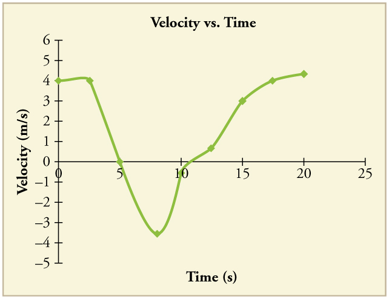

* Describe a straight-line graph in terms of its slope and y-intercept.
* Determine average velocity or instantaneous velocity from a graph of position vs. time.
* Determine average or instantaneous acceleration from a graph of velocity vs. time.
* Derive a graph of velocity vs. time from a graph of position vs. time.
* Derive a graph of acceleration vs. time from a graph of velocity vs. time.

A graph, like a picture, is worth a thousand words. Graphs not only contain
numerical information; they also reveal relationships between physical
quantities. This section uses graphs of position, velocity, and acceleration
versus time to illustrate one-dimensional kinematics.

### Slopes and General Relationships

First note that graphs in this text have perpendicular axes, one horizontal and
the other vertical. When two physical quantities are plotted against one another
in such a graph, the horizontal axis is usually considered to be an
**independent variable** and the vertical axis a **dependent variable**. If we
call the horizontal axis the $$ x $$ -axis and the vertical axis the $$ y $$
-axis, as in [Figure 1](#Figure1), a straight-line graph has the general form

 $$ y= m x+b. $$

Here $$ m $$ is the **slope**, defined to be the rise divided by the run (as
seen in the figure) of the straight line. The letter $$ b $$ is used for the
**y-intercept**, which is the point at which the line crosses the vertical axis.

')
{: #Figure1}

### Graph of Position vs. Time (_a_ = 0, so _v_ is constant)

Time is usually an independent variable that other quantities, such as position,
depend upon. A graph of position versus time would, thus, have $$ x $$ on the
vertical axis and $$ t $$ on the horizontal axis. [Figure 2](#Figure2) is just such
a straight-line graph. It shows a graph of position versus time for a
jet-powered car on a very flat dry lake bed in Nevada.

{: #Figure2}

Using the relationship between dependent and independent variables, we see that
the slope in the graph above is average velocity $$ \overline{v} $$ and the
intercept is position at time zero—that is, $$ x\_{0} $$. Substituting these
symbols into $$ y= mx+b $$ gives

 $$ x=\overline{v}t+x_{0} $$

or

 $$ x=x_{0}+\overline{v}t . $$

Thus a graph of position versus time gives a general relationship among
displacement(change in position), velocity, and time, as well as giving detailed
numerical information about a specific situation.

The Slope of *x* vs. *t*

The slope of the graph of position $$ x $$ vs. time $$ t $$ is velocity $$ v $$.

 $$ \text{slope}=\frac{ \Delta x}{\Delta t}=v $$

Notice that this equation is the same as that derived algebraically from other motion equations 
in [Motion Equations for Constant Acceleration in One Dimension](./ch2MotionEquationsForConstantAccelerationInOneDimension).

From the figure we can see that the car has a position of 25 m at 0.50 s and
2000 m at 6.40 s. Its position at other times can be read from the graph;
furthermore, information about its velocity and acceleration can also be
obtained from the graph.

Determining Average Velocity from a Graph of Position versus Time: Jet Car

Find the average velocity of the car whose position is graphed in [Figure 2](#Figure2).

**Strategy**

The slope of a graph of $$ x $$ vs. $$ t $$ is average velocity, since slope
equals rise over run. In this case, rise = change in position and run = change
in time, so that

 $$ \text{slope}=\frac{ \Delta x}{\Delta t}=\overline{v}. $$

Since the slope is constant here, any two points on the graph can be used to find the slope. (Generally speaking, it is most accurate to use two widely separated points on the straight line. This is because any error in reading data from the graph is proportionally smaller if the interval is larger.)

**Solution**

1\. Choose two points on the line. In this case, we choose the points labeled on
the graph: (6.4 s, 2000 m) and (0.50 s, 525 m). (Note, however, that you could
choose any two points.)

2\. Substitute the $$ x $$ and $$ t $$ values of the chosen points into the
equation. Remember in calculating change $$ \left(\Delta \right) $$ we always
use final value minus initial value.

 $$ \overline{v}=\frac{ \Delta x}{\Delta t}=\frac{2000 \m -525 \m }{6.4 \s  -0.50 \s }, $$

yielding

 $$ \overline{v}=250 \ms . $$

**Discussion**

This is an impressively large land speed (900 km/h, or about 560 mi/h): much
greater than the typical highway speed limit of 60 mi/h (27 m/s or 96 km/h), but
considerably shy of the record of 343 m/s (1234 km/h or 766 mi/h) set in 1997.

### Graphs of Motion when $$ a $$ is constant but $$ a\ne 0 $$

The graphs in [Figure 3](#Figure3)
below represent the motion of the jet-powered car as it accelerates toward its
top speed, but only during the time when its acceleration is constant. Time
starts at zero for this motion (
as if measured with a stopwatch), and the position and velocity are initially
200 m and 15 m/s, respectively.

 The slope of an (x) vs. (t) graph is velocity. This is shown at two points, and the instantaneous velocities obtained are plotted in the next graph. Instantaneous velocity at any point is the slope of the tangent at that point.
(b) The slope of the (v) vs. (t) graph is constant for this part of the motion, indicating constant acceleration.
(c) Acceleration has the constant value of (5.0 \\mss ) over the time interval plotted.')
{: #Figure3}

')
{: #Figure4}

The graph of position versus time in [Figure 3](#Figure3)(a) is a curve rather than
a straight line. The slope of the curve becomes steeper as time progresses,
showing that the velocity is increasing over time. The slope at any point on a
position-versus-time graph is the instantaneous velocity at that point. It is
found by drawing a straight line tangent to the curve at the point of interest
and taking the slope of this straight line. Tangent lines are shown for two
points in [Figure 3](#Figure3)(a). If this is done at every point on the curve and
the values are plotted against time, then the graph of velocity versus time
shown in [Figure 3](#Figure3)(b) is obtained. Furthermore, the slope of the graph
of velocity versus time is acceleration, which is shown in [Figure 3](#Figure3)(c).

Determining Instantaneous Velocity from the Slope at a Point: Jet Car

Calculate the velocity of the jet car at a time of 25 s by finding the slope of the $$ x $$ vs. $$ t $$
graph in the graph below.

![A graph of displacement versus time for a jet car. The x axis for time runs from zero to thirty five seconds. The y axis for displacement runs from zero to three thousand meters. The curve depicting displacement is concave up. The slope of the curve increases over time. Slope equals velocity v. There are two points on the curve, labeled, P and Q. P is located at time equals ten seconds. Q is located and time equals twenty-five seconds. A line tangent to P at ten seconds is drawn and has a slope delta x sub P over delta t sub p. A line tangent to Q at twenty five seconds is drawn and has a slope equal to delta x sub q over delta t sub q. Select coordinates are given in a table and consist of the following: time zero seconds displacement two hundred meters; time five seconds displacement three hundred thirty eight meters; time ten seconds displacement six hundred meters; time fifteen seconds displacement nine hundred eighty eight meters. Time twenty seconds displacement one thousand five hundred meters; time twenty five seconds displacement two thousand one hundred thirty eight meters; time thirty seconds displacement two thousand nine hundred meters.](../resources/Figure_02_08_05.jpg 'The slope of an ( x ) vs. ( t ) graph is velocity. This is shown at two points. Instantaneous velocity at any point is the slope of the tangent at that point.')
{: #Figure5}

**Strategy**

The slope of a curve at a point is equal to the slope of a straight line tangent
to the curve at that point. This principle is illustrated in [Figure 5](#Figure5),
where Q is the point at $$ t=25 \s $$.

**Solution**

1\. Find the tangent line to the curve at $$ t=25 \s $$.

2\. Determine the endpoints of the tangent. These correspond to a position of
1300 m at time 19 s and a position of 3120 m at time 32 s.

3\. Plug these endpoints into the equation to solve for the slope, $$ v $$.

 $$ \text{slope}=v_{Q}=\frac{ \Delta x_{Q}}{ \Delta t_{Q}}=\frac{ \left(3120 \m -1300 \m \right)}{\left(32 \s  -19 \s \right)} $$

Thus,

 $$ v_{Q}=\frac{1820 \m }{13 \s }=140 \ms . $$

**Discussion**

This is the value given in this figure’s table for $$ v $$ at $$ t=25 \s $$. The
value of 140 m/s for $$ v\_{Q} $$ is plotted in [Figure 5](#Figure5). The entire
graph of $$ v $$ vs. $$ t $$ can be obtained in this fashion.

Carrying this one step further, we note that the slope of a velocity versus time
graph is acceleration. Slope is rise divided by run; on a $$ v $$ vs. $$ t $$
graph, rise = change in velocity $$ \Delta v $$ and run = change in time $$ \Delta t $$.

The Slope of \(v \) vs. \(t\)

The slope of a graph of velocity $$ v $$ vs. time $$ t $$
is acceleration $$ a $$.

 $$ \text{slope}=\frac{ \Delta v}{\Delta t}=a $$

Since the velocity versus time graph in [Figure 3](#Figure3)(b) is a straight line,
its slope is the same everywhere, implying that acceleration is constant.
Acceleration versus time is graphed in [Figure 3](#Figure3)(c).

Additional general information can be obtained from [Figure 5](#Figure5) and the
expression for a straight line, $$ y=m x+b $$.

In this case, the vertical axis $$ y $$ is $$ V $$, the intercept $$ b $$ is $$ v_{0} $$, the slope $$ m $$ is $$ a $$, and the horizontal axis $$ x $$ is $$ t $$
. Substituting these symbols yields

 $$ v=v_{0}+a t . $$

A general relationship for velocity, acceleration, and time has again been
obtained from a graph. Notice that this equation was also derived algebraically
from other motion equations
in [Motion Equations for Constant Acceleration in One Dimension](./ch2MotionEquationsForConstantAccelerationInOneDimension)
.

It is not accidental that the same equations are obtained by graphical analysis
as by algebraic techniques. In fact, an important way to *discover* physical
relationships is to measure various physical quantities and then make graphs of
one quantity against another to see if they are correlated in any way.
Correlations imply physical relationships and might be shown by smooth graphs
such as those above. From such graphs, mathematical relationships can sometimes
be postulated. Further experiments are then performed to determine the validity
of the hypothesized relationships.

### Graphs of Motion Where Acceleration is Not Constant

Now consider the motion of the jet car as it goes from 165 m/s to its top
velocity of 250 m/s, graphed in [Figure 6](#Figure6). Time again starts at zero,
and the initial position and velocity are 2900 m and 165 m/s, respectively. (
These were the final position and velocity of the car in the motion graphed
in [Figure 3](#Figure3).) Acceleration gradually decreases from $$ 5.0 \mss $$ to
zero when the car hits 250 m/s. The slope of the $$ x $$ vs. $$ t $$ graph
increases until $$ t=55 \s $$, after which time the slope is constant.
Similarly, velocity increases until 55 s and then becomes constant, since
acceleration decreases to zero at 55 s and remains zero afterward.

 The slope of this graph is velocity; it is plotted in the next graph.
(b) The velocity gradually approaches its top value. The slope of this graph is acceleration; it is plotted in the final graph.
(c) Acceleration gradually declines to zero when velocity becomes constant.")
{: #Figure6}

Calculating Acceleration from a Graph of Velocity versus Time

Calculate the acceleration of the jet car at a time of 25 s by finding the
slope of the $$ v $$ vs. $$ t $$ graph in [Figure 6](#Figure6)(b).

**Strategy**

The slope of the curve at $$ t=25 \s $$ is equal to the slope of the line
tangent at that point, as illustrated in [Figure 6](#Figure6)(b).

**Solution**

Determine endpoints of the tangent line from the figure, and then plug them into
the equation to solve for slope, $$ a $$.

 $$ \text{slope}=\frac{ \Delta v}{\Delta t}=\frac{ \left(260 \ms -210 \ms \right)}{\left(51 \s  -1.0 s\right)} $$

 $$ a=\frac{50 \ms }{50 \s }=1.0 \mss . $$

**Discussion**

Note that this value for $$ a $$ is consistent with the value plotted
in [Figure 6](#Figure6)(c) at $$ t=25 \s $$.

A graph of position versus time can be used to generate a graph of velocity
versus time, and a graph of velocity versus time can be used to generate a graph
of acceleration versus time. We do this by finding the slope of the graphs at
every point. If the graph is linear (i.e., a line with a constant slope), it is
easy to find the slope at any point and you have the slope for every point.
Graphical analysis of motion can be used to describe both specific and general
characteristics of kinematics. Graphs can also be used for other topics in
physics. An important aspect of exploring physical relationships is to graph
them and look for underlying relationships.

Check Your Understanding

A graph of velocity vs. time of a ship coming into a harbor is shown below.
(a) Describe the motion of the ship based on the graph.
(b) What would a graph of the ship’s acceleration look like?

{: #Figure7}

(a) The ship moves at constant velocity and then begins
to decelerate at a constant rate. At some point, its deceleration rate
decreases. It maintains this lower deceleration rate until it stops moving.

(b) A graph of acceleration vs. time would show zero acceleration in the first
leg, large and constant negative acceleration in the second leg, and constant
negative acceleration.

{: #Figure8}

### Section Summary

* Graphs of motion can be used to analyze motion.
* Graphical solutions yield identical solutions to mathematical methods for
  deriving motion equations.
* The slope of a graph of displacement $$ x $$ vs. time $$ t $$ is velocity $$ v $$.
* The slope of a graph of velocity $$ v $$ vs. time $$ t $$ graph is acceleration $$ a $$.
* Average velocity, instantaneous velocity, and acceleration can all be obtained
  by analyzing graphs.

### Conceptual Questions

(a) Explain how you can use the graph of position versus time in [Figure 9](#Figure9) to describe the change in velocity over time.
Identify (b) the time ( $$ t_{a} $$, $$ t_{b} $$, $$ t_{c} $$, $$ t_{d} $$, or $$ t_{e} $$) at which the instantaneous velocity is greatest,
(c) the time at which it is
zero, and
(d) the time at which it is negative.

{: #Figure9}

(a) Sketch a graph of velocity versus time corresponding to the graph of position versus time given in [Figure 10](#Figure10).
(b) Identify the time or times ( $$ t_{a} $$, $$ t_{b} $$, $$ t_{c} $$, etc.) at which the instantaneous velocity is
greatest.
(c) At which times is it zero?
(d) At which times is it negative?

{: #Figure10}

(a) Explain how you can determine the acceleration over time from a velocity versus time graph such as the one in [Figure 11](#Figure11).
(b) Based on the graph, how does acceleration change over time?

{: #Figure11}

(a) Sketch a graph of acceleration versus time corresponding to the graph of velocity versus time given in [Figure 12](#Figure12).
(b) Identify the time or times ( $$ t_{a} $$, $$ t_{b} $$, $$ t_{c} $$, etc.) at which the acceleration is greatest.
(c) At which times is it zero?
(d) At which times is it negative?

{: #Figure12}

Consider the velocity vs. time graph of a person in an elevator
shown in [Figure 13](#Figure13). Suppose the elevator is initially at rest.
It then accelerates for 3 seconds, maintains that velocity for 15 seconds,
then decelerates for 5 seconds until it stops. The acceleration for the entire trip is
not constant so we cannot use the equations of motion from
[Motion Equations for Constant Acceleration in One Dimension](./ch2MotionEquationsForConstantAccelerationInOneDimension) for the complete trip.
(We could, however, use them in the three individual sections where acceleration is a constant.)
Sketch graphs of (a) position vs. time and (b) acceleration vs. time for this trip.

{: #Figure13}

A cylinder is given a push and then rolls up an inclined plane.
If the origin is the starting point, sketch the position, velocity, and acceleration of the cylinder vs.
time as it goes up and then down the plane.

### Problems &amp; Exercises

Note: There is always uncertainty in numbers taken from graphs. If your answers
differ from expected values, examine them to see if they are within data
extraction uncertainties estimated by you.

(a) By taking the slope of the curve in [Figure 14](#Figure14), verify that the velocity of the jet car is 115 m/s at $$ t=20 \s $$.
(b) By taking the slope of the curve at any point
in [Figure 15](#Figure15), verify that the jet car’s acceleration is
$$ 5.0 \mss $$.

{: #Figure14}

{: #Figure15}

**Strategy**

For part (a), we find the velocity by calculating the slope of the position-time graph at $$ t = 20 \s $$. For part (b), we find the acceleration by calculating the slope of the velocity-time graph, which should give a constant value since Figure 15 appears to be a straight line. The slope is calculated using $$ \text{slope} = \frac{\Delta y}{\Delta x} $$, where the axes represent position and time for velocity, and velocity and time for acceleration.

**Solution**

**(a) Finding velocity from the position-time graph:**

1. To find the instantaneous velocity at $$ t = 20 \s $$, we need to find the slope of the position-time curve in Figure 14 at that point.

2. From Figure 14, we can estimate the slope by drawing a tangent line or by choosing two points on the curve near $$ t = 20 \s $$. Looking at the graph, we can estimate points approximately:
   - At $$ t_1 \approx 15 \s $$: $$ x_1 \approx 1000 \m $$
   - At $$ t_2 \approx 25 \s $$: $$ x_2 \approx 2150 \m $$

3. Calculate the slope:

$$ v = \frac{\Delta x}{\Delta t} = \frac{x_2 - x_1}{t_2 - t_1} = \frac{2150 - 1000}{25 - 15} = \frac{1150}{10} = 115 \ms $$

**(b) Finding acceleration from the velocity-time graph:**

1. The acceleration is the slope of the velocity-time graph in Figure 15.

2. Since Figure 15 is a straight line, the slope is constant. From the graph, we can read approximate values:
   - At $$ t_1 = 0 \s $$: $$ v_1 = 0 \ms $$
   - At $$ t_2 = 20 \s $$: $$ v_2 = 100 \ms $$

3. Calculate the slope:

$$ a = \frac{\Delta v}{\Delta t} = \frac{v_2 - v_1}{t_2 - t_1} = \frac{100 - 0}{20 - 0} = \frac{100}{20} = 5.0 \mss $$

**Discussion**

These calculations demonstrate the fundamental relationships in kinematics: velocity is the slope of the position-time graph, and acceleration is the slope of the velocity-time graph. The jet car's velocity of 115 m/s at $$ t = 20 \s $$ represents an extremely high speed (about 410 km/h or 257 mph), consistent with a jet-powered vehicle. The constant acceleration of $$ 5.0 \mss $$ shown in the straight-line velocity graph indicates that the jet car is accelerating uniformly. This acceleration is about half of gravitational acceleration, which is substantial for maintaining over an extended period. The parabolic shape of the position-time curve in Figure 14 is characteristic of constant acceleration motion.

**Answer**

(a) The velocity of the jet car at $$ t = 20 \s $$ is 115 m/s, verified by taking the slope of the position-time curve in Figure 14.

(b) The jet car's acceleration is $$ 5.0 \mss $$, verified by taking the slope of the velocity-time graph in Figure 15.

Using approximate values, calculate the slope of the curve
in [Figure 16](#Figure16) to verify that the velocity at $$ t=10.0 \s $$
is 0.208 m/s. Assume all values are known to 3 significant figures.

{: #Figure16}

**Strategy**

The slope of a position vs. time graph gives the velocity. To find the instantaneous velocity at $$ t = 10.0 \s $$, we need to find the slope of the curve at that point. Since this appears to be a straight line, we can choose two points on the line (preferably well-separated for accuracy) and calculate the slope using $$ v = \frac{\Delta x}{\Delta t} $$.

**Solution**

From Figure 16, we can read approximate values from the graph. Let's choose two points that are widely separated:

At $$ t_1 = 0.0 \s $$, the position is approximately $$ x_1 = 0.50 \text{ km} = 500 \m $$

At $$ t_2 = 20.0 \s $$, the position is approximately $$ x_2 = 4.65 \text{ km} = 4650 \m $$

Now calculate the slope:

$$ v = \frac{\Delta x}{\Delta t} = \frac{x_2 - x_1}{t_2 - t_1} = \frac{4650 \m - 500 \m}{20.0 \s - 0.0 \s} $$

$$ v = \frac{4150 \m}{20.0 \s} = 207.5 \ms \approx 208 \ms $$

To verify at $$ t = 10.0 \s $$ specifically, we can also use points around that time:

At $$ t_1 = 5.0 \s $$, $$ x_1 \approx 1.54 \text{ km} = 1540 \m $$

At $$ t_2 = 15.0 \s $$, $$ x_2 \approx 3.62 \text{ km} = 3620 \m $$

$$ v = \frac{3620 \m - 1540 \m}{15.0 \s - 5.0 \s} = \frac{2080 \m}{10.0 \s} = 208 \ms $$

**Discussion**

The velocity is constant throughout the motion because the position-time graph is a straight line. The positive slope indicates the object is moving in the positive direction. This value of 208 m/s (or 0.208 km/s) is consistent across different time intervals, confirming that the motion has zero acceleration.

**Answer**

The velocity at $$ t = 10.0 \s $$ is 208 m/s (or 0.208 km/s), which verifies the given value.

Using approximate values, calculate the slope of the curve in [Figure 16](#Figure16) to verify that the velocity at $$ t=30.0 \s $$
is approximately 0.24 m/s.

**Strategy**

To find the instantaneous velocity at $$ t = 30.0 \s $$, we need to find the slope of the position-time graph at that point. Since Figure 16 shows a curve (not a straight line), we draw a tangent line at $$ t = 30.0 \s $$ or use nearby points to estimate the slope. The velocity is calculated using $$ v = \frac{\Delta x}{\Delta t} $$.

**Solution**

1. To find the velocity at $$ t = 30.0 \s $$, examine Figure 16 near that time and identify two points on the curve that we can use to estimate the slope.

2. From the graph, choosing points symmetrically around $$ t = 30.0 \s $$:
   - At $$ t_1 = 20.0 \s $$: $$ x_1 \approx 6.95 \text{ km} = 6.95 \times 10^{3} \m $$
   - At $$ t_2 = 40.0 \s $$: $$ x_2 \approx 11.7 \text{ km} = 11.7 \times 10^{3} \m $$

3. Calculate the slope:

$$ v = \frac{\Delta x}{\Delta t} = \frac{x_2 - x_1}{t_2 - t_1} = \frac{(11.7 - 6.95) \times 10^{3} \m}{40.0 - 20.0 \s} $$

$$ v = \frac{4.75 \times 10^{3} \m}{20.0 \s} = 238 \ms $$

4. Converting to km/s (which appears to be the units intended in the problem):

$$ v = 238 \ms = 0.238 \text{ km/s} \approx 0.24 \text{ km/s} $$

**Discussion**

The calculated velocity of 238 m/s (or approximately 0.24 km/s) is the instantaneous velocity at $$ t = 30.0 \s $$. This high velocity is consistent with Figure 16, which appears to show a spacecraft or high-speed vehicle's position measured in kilometers. The velocity of 238 m/s is approximately 856 km/h or 532 mph. The graph shows increasing position with time, indicating positive velocity throughout the motion. Note that when working with graphs, the choice of units is critical - the problem statement likely intended the answer in km/s (0.24 km/s) rather than m/s to match the position units shown in kilometers.

**Answer**

The velocity at $$ t = 30.0 \s $$ is approximately 238 m/s (or 0.24 km/s), verified by calculating the slope of the position-time curve in Figure 16.

By taking the slope of the curve in [Figure 17](#Figure17), verify
that the acceleration is $$ 3.2 \mss $$ at $$ t=10 \s $$.

{: #Figure17}

**Strategy**

The slope of a velocity vs. time graph gives the acceleration. Since the curve in Figure 17 is not a straight line, the acceleration varies with time. To find the instantaneous acceleration at $$ t = 10 \s $$, we need to draw a tangent line to the curve at that point and calculate the slope of the tangent line using $$ a = \frac{\Delta v}{\Delta t} $$.

**Solution**

To find the acceleration at $$ t = 10 \s $$, we draw a tangent line to the curve at that point.

From the tangent line at $$ t = 10 \s $$, we can identify two points on the tangent:

At $$ t_1 \approx 5 \s $$, the tangent line gives $$ v_1 \approx 100 \ms $$

At $$ t_2 \approx 20 \s $$, the tangent line gives $$ v_2 \approx 148 \ms $$

Now calculate the slope of the tangent line:

$$ a = \frac{\Delta v}{\Delta t} = \frac{v_2 - v_1}{t_2 - t_1} = \frac{148 \ms - 100 \ms}{20 \s - 5 \s} $$

$$ a = \frac{48 \ms}{15 \s} = 3.2 \mss $$

**Discussion**

The acceleration at $$ t = 10 \s $$ is positive, indicating that the velocity is increasing at this time. However, the curve shows that the slope (acceleration) is decreasing as time progresses, eventually approaching zero when the velocity becomes constant. This represents a situation where an object is speeding up but the rate at which it speeds up is decreasing over time. This could represent a car accelerating but approaching its maximum speed, or an object experiencing increasing air resistance as it speeds up.

**Answer**

The acceleration at $$ t = 10 \s $$ is $$ 3.2 \mss $$, which verifies the given value.

Construct the position graph for the subway shuttle train as shown
in the [Acceleration module](./ch2Acceleration) (a).
Your graph should show the position of the train, in kilometers, from t = 0 to 20 s.
You will need to use the information on acceleration and velocity given in
the examples for this figure.

**Strategy**

To construct a position-time graph from velocity and acceleration information, we use the relationships between these quantities. The position changes according to the area under the velocity-time curve. We need to refer to the Acceleration module example to get the specific values for the subway train's motion, then integrate the velocity over time to find position. The graph should show two distinct phases of motion based on the changing velocity.

**Solution**

From the Acceleration module example, the subway train's motion has two phases:

**Phase 1 (0 to 10 s): Constant velocity of 5.0 m/s**
1. Initial position: $$ x_0 = 0 \text{ km} $$ at $$ t = 0 $$
2. Position increases linearly: $$ x = v \cdot t = (5.0 \ms)(t) $$
3. At $$ t = 10 \s $$: $$ x = 5.0 \times 10 = 50 \m = 0.050 \text{ km} $$

**Phase 2 (10 to 20 s): Constant acceleration of $$ 1.3 \mss $$**
1. Initial velocity at $$ t = 10 \s $$: $$ v_0 = 5.0 \ms $$
2. Initial position at $$ t = 10 \s $$: $$ x_0 = 50 \m $$
3. For constant acceleration starting at $$ t = 10 \s $$:

$$ x = x_0 + v_0(t - 10) + \frac{1}{2}a(t - 10)^2 $$

4. At $$ t = 20 \s $$ (i.e., 10 s after acceleration begins):

$$ x = 50 + (5.0)(10) + \frac{1}{2}(1.3)(10)^2 $$

$$ x = 50 + 50 + 65 = 165 \m = 0.165 \text{ km} $$

**Constructing the graph:**
- From $$ t = 0 $$ to $$ 10 \s $$: Draw a straight line from (0, 0) to (10 s, 0.050 km) with constant slope
- From $$ t = 10 \s $$ to $$ 20 \s $$: Draw a parabolic curve from (10 s, 0.050 km) to (20 s, 0.165 km) with increasing slope
- The curve should show a "kink" at $$ t = 10 \s $$ where the motion transitions from constant velocity to constant acceleration

**Discussion**

The position-time graph clearly shows two distinct motion phases. In the first 10 seconds, the train moves at constant velocity, producing a straight line with constant slope (5.0 m/s). At $$ t = 10 \s $$, the train begins accelerating, which creates a parabolic curve with increasing slope. The kink at $$ t = 10 \s $$ represents the instant the acceleration begins. The steeper slope in the second phase reflects the increasing velocity due to acceleration. This type of piecewise motion is common in real transportation systems, where vehicles may cruise at constant speed before accelerating to reach their destination more quickly.

**Answer**

The position-time graph shows the train starting at the origin and moving with constant velocity (5.0 m/s) for the first 10 seconds, reaching 0.050 km. At $$ t = 10 \s $$, the train begins accelerating at $$ 1.3 \mss $$, following a parabolic path to reach approximately 0.165 km at $$ t = 20 \s $$.

{: #Figure18}

(a) Take the slope of the curve in [Figure 19](#Figure19) to find the jogger's velocity at $$ t=2.5 \s $$.
(b) Repeat at 7.5 s. These values must be consistent with the graph
in [Figure 20](#Figure20).

{: #Figure19}

{: #Figure20}

{: #Figure21}

**Strategy**

The slope of a position vs. time graph at any point gives the instantaneous velocity at that time. Since Figure 19 shows a curved line with changing slope, we need to draw tangent lines at $$ t = 2.5 \s $$ and $$ t = 7.5 \s $$ and calculate their slopes. The results should be consistent with the corresponding velocity values shown in Figure 20.

**Solution**

**(a) Velocity at $$ t = 2.5 \s $$:**

Draw a tangent line to the position curve at $$ t = 2.5 \s $$. From the tangent line, we can identify two points:

At $$ t_1 \approx 0 \s $$, the tangent gives $$ x_1 \approx 0 \m $$

At $$ t_2 \approx 5 \s $$, the tangent gives $$ x_2 \approx 20 \m $$

Calculate the slope:

$$ v = \frac{\Delta x}{\Delta t} = \frac{x_2 - x_1}{t_2 - t_1} = \frac{20 \m - 0 \m}{5 \s - 0 \s} = \frac{20 \m}{5 \s} = 4 \ms $$

Checking Figure 20, at $$ t = 2.5 \s $$, the velocity graph shows approximately $$ 4 \ms $$. ✓

**(b) Velocity at $$ t = 7.5 \s $$:**

Draw a tangent line to the position curve at $$ t = 7.5 \s $$. This section of the curve slopes downward, indicating negative velocity. From the tangent line:

At $$ t_1 \approx 5 \s $$, the tangent gives $$ x_1 \approx 40 \m $$

At $$ t_2 \approx 10 \s $$, the tangent gives $$ x_2 \approx 20 \m $$

Calculate the slope:

$$ v = \frac{\Delta x}{\Delta t} = \frac{x_2 - x_1}{t_2 - t_1} = \frac{20 \m - 40 \m}{10 \s - 5 \s} = \frac{-20 \m}{5 \s} = -4 \ms $$

Checking Figure 20, at $$ t = 7.5 \s $$, the velocity graph shows approximately $$ -4 \ms $$. ✓

**Discussion**

The results demonstrate the fundamental relationship between position and velocity graphs. At $$ t = 2.5 \s $$, the position graph has a positive slope, meaning the jogger is moving in the positive direction at $$ 4 \ms $$. At $$ t = 7.5 \s $$, the position graph has a negative slope, indicating the jogger is moving in the negative direction (perhaps running back) at $$ -4 \ms $$. The magnitudes are equal but opposite in sign, showing the jogger runs backward at the same speed as forward. The values extracted from the position-time graph are perfectly consistent with the velocity-time graph in Figure 20.

**Answer**

(a) The jogger's velocity at $$ t = 2.5 \s $$ is approximately $$ 4 \ms $$.

(b) The jogger's velocity at $$ t = 7.5 \s $$ is approximately $$ -4 \ms $$.

A graph of $$ v\left(t\right) $$ is shown for a world-class track sprinter
in a 100-m race. (See [Figure 22](#Figure22)).
(a) What is his average velocity for the
first 4 s?
(b) What is his instantaneous velocity at $$ t=5 \s $$ ?
(c) What is his average acceleration between 0 and 4 s?
(d) What is his time for the race?

{: #Figure22}

**Strategy**

Figure 22 shows a velocity-time graph with two distinct segments: an accelerating phase and a constant velocity phase. For part (a), average velocity equals displacement divided by time, which is the area under the velocity curve divided by time. For part (b), instantaneous velocity is read directly from the graph. For part (c), average acceleration is the slope of the velocity curve. For part (d), the race time is when the total displacement (area under curve) equals 100 m.

**Solution**

**(a) Average velocity for the first 4 s:**

The average velocity is:

$$ \bar{v} = \frac{\Delta x}{\Delta t} $$

From Figure 22, the velocity increases linearly from 0 to 12 m/s during the first 4 seconds. The displacement is the area under the velocity curve:

$$ \Delta x = \frac{1}{2}(v_0 + v)(t) = \frac{1}{2}(0 + 12)(4) = 24 \m $$

Therefore:

$$ \bar{v} = \frac{24 \m}{4 \s} = 6 \ms $$

**(b) Instantaneous velocity at $$ t = 5 \s $$:**

From Figure 22, at $$ t = 5 \s $$, the sprinter has reached the constant velocity phase. Reading directly from the graph:

$$ v(5 \s) = 12 \ms $$

**(c) Average acceleration between 0 and 4 s:**

The average acceleration is:

$$ \bar{a} = \frac{\Delta v}{\Delta t} = \frac{v_f - v_0}{t_f - t_0} $$

$$ \bar{a} = \frac{12 \ms - 0 \ms}{4 \s - 0 \s} = \frac{12}{4} = 3 \mss $$

**(d) Time for the 100-m race:**

The total displacement must equal 100 m. The graph shows two phases:

**Phase 1 (0 to 4 s): Acceleration**
- Displacement: $$ x_1 = \frac{1}{2}(12)(4) = 24 \m $$

**Phase 2 (4 s to $$ t_f $$): Constant velocity of 12 m/s**
- Remaining distance: $$ 100 - 24 = 76 \m $$
- Time for remaining distance: $$ t_2 = \frac{76 \m}{12 \ms} = 6.33 \s $$

Total time:

$$ t_{\text{total}} = 4 + 6.33 = 10.33 \s \approx 10 \s $$

**Discussion**

This velocity-time graph illustrates a world-class sprinter's race strategy. The sprinter accelerates at $$ 3 \mss $$ for 4 seconds, reaching a maximum velocity of 12 m/s (about 43 km/h or 27 mph). During acceleration, the average velocity is only 6 m/s because the sprinter starts from rest. After reaching maximum velocity, the sprinter maintains it for the remainder of the race. The total race time of approximately 10 seconds is consistent with world-class 100-m sprint times. The acceleration phase covers only 24 m (less than a quarter of the race), while the constant velocity phase covers 76 m. This demonstrates that even elite sprinters spend most of the race at constant maximum velocity rather than accelerating.

**Answer**

(a) The average velocity for the first 4 s is 6 m/s.

(b) The instantaneous velocity at $$ t = 5 \s $$ is 12 m/s.

(c) The average acceleration between 0 and 4 s is $$ 3 \mss $$.

(d) The time for the 100-m race is approximately 10 s.

[Figure 23](#Figure23) shows the position graph for a particle for 5 s. Draw the corresponding velocity and acceleration graphs.

{: #Figure23}

**Strategy**

To construct the velocity graph from the position graph, we calculate the slope of each segment, since velocity equals the slope of the position-time graph. To construct the acceleration graph from the velocity graph, we calculate the slope of the velocity-time graph, since acceleration equals the slope of velocity vs. time. We analyze each distinct segment where the slope is constant.

**Solution**

**Analyzing the Position Graph (Figure 23):**

The position graph has four distinct linear segments:

**Segment 1 (0 to 1 s):** Positive slope
- From the graph: $$ \Delta x \approx 2 \m $$, $$ \Delta t = 1 \s $$
- Velocity: $$ v_1 = \frac{2 \m}{1 \s} = 2 \ms $$

**Segment 2 (1 to 2 s):** Negative slope
- From the graph: $$ \Delta x \approx -4 \m $$, $$ \Delta t = 1 \s $$
- Velocity: $$ v_2 = \frac{-4 \m}{1 \s} = -4 \ms $$

**Segment 3 (2 to 4 s):** Zero slope (horizontal line)
- The position is constant
- Velocity: $$ v_3 = 0 \ms $$

**Segment 4 (4 to 5 s):** Positive slope
- From the graph: $$ \Delta x \approx 1 \m $$, $$ \Delta t = 1 \s $$
- Velocity: $$ v_4 = \frac{1 \m}{1 \s} = 1 \ms $$

**Velocity Graph:**

The velocity graph is a series of horizontal line segments at:
- $$ v = 2 \ms $$ from $$ t = 0 $$ to $$ 1 \s $$
- $$ v = -4 \ms $$ from $$ t = 1 $$ to $$ 2 \s $$
- $$ v = 0 \ms $$ from $$ t = 2 $$ to $$ 4 \s $$
- $$ v = 1 \ms $$ from $$ t = 4 $$ to $$ 5 \s $$

**Analyzing the Velocity Graph for Acceleration:**

The acceleration is the slope of the velocity graph. At transition points, there are instantaneous changes (vertical jumps) in velocity, which represent infinite acceleration. In reality, these would be very large but finite accelerations:

- **0 to 1 s:** Constant velocity, so $$ a = 0 $$
- **At t = 1 s:** Velocity changes from $$ 2 \ms $$ to $$ -4 \ms $$ (vertical jump)
- **1 to 2 s:** Constant velocity, so $$ a = 0 $$
- **At t = 2 s:** Velocity changes from $$ -4 \ms $$ to $$ 0 \ms $$ (vertical jump)
- **2 to 4 s:** Constant velocity, so $$ a = 0 $$
- **At t = 4 s:** Velocity changes from $$ 0 \ms $$ to $$ 1 \ms $$ (vertical jump)
- **4 to 5 s:** Constant velocity, so $$ a = 0 $$

**Acceleration Graph:**

The acceleration graph shows $$ a = 0 $$ for all segments between transitions, with vertical spikes (impulses) at $$ t = 1 \s $$, $$ t = 2 \s $$, and $$ t = 4 \s $$ where the velocity changes abruptly.

**Discussion**

The position graph shows a particle that moves forward, then backward, then stops for a period, then moves forward again. Each segment has constant velocity (straight line segments), so acceleration is zero during those times. The sharp corners in the position graph correspond to abrupt changes in velocity, which would require very large (theoretically infinite) accelerations. In real physical situations, these corners would be slightly rounded, representing large but finite accelerations over very short time intervals.

**Answer**

The velocity graph consists of horizontal segments at 2 m/s (0-1 s), -4 m/s (1-2 s), 0 m/s (2-4 s), and 1 m/s (4-5 s). The acceleration graph is zero throughout except for vertical spikes at t = 1 s, 2 s, and 4 s where the velocity changes instantaneously.

### Glossary
{: class="glossary-title"}

independent variable
: the variable that the dependent variable is measured with respect to; usually
plotted along the $$ x $$ -axis

dependent variable
: the variable that is being measured; usually plotted along the $$ y $$ -axis

slope
: the difference in $$ y $$ -value (the rise) divided by the difference in $$ x $$-value (the run) of two points on a straight line

y-intercept
: the $$ y\text{-} $$ value when $$ x = 0 $$, or when the graph crosses the $$ y $$ -axis

